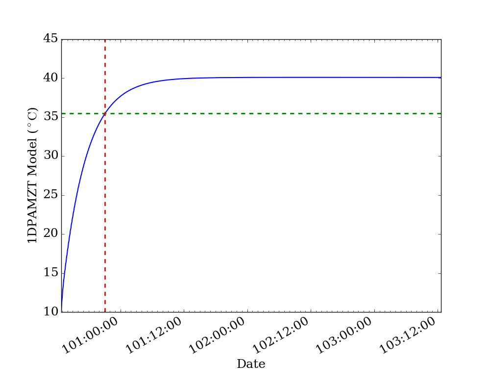
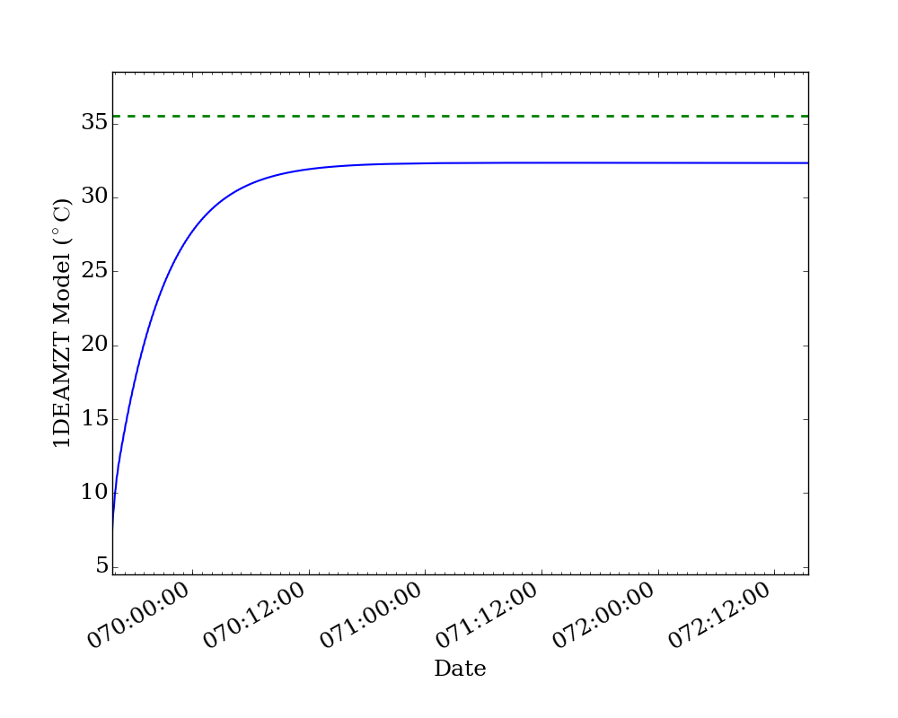

Using the Command Line Tools
============================

For making quick plots and getting quick summaries of important information, the 
following command-line utilities are provided. For finer-grained control over plots
and data, it is recommended to use the Python interface.

``get_expected_acis_status``
----------------------------

.. code-block:: text

    usage: get_expected_acis_status [-h] [--time TIME] load

    Get a summary of the expected ACIS status given a load

    positional arguments:
      load         The load to get the status from

    optional arguments:
      -h, --help   show this help message and exit
      --time TIME  The time to check the status at (default: current time)

Example
+++++++

.. code-block:: bash

    [~]$ get_expected_acis_status APR0416C --time=2016:100:18:00:00
    
Returns:

.. code-block:: text

    Getting expected ACIS state at 2016:100:18:00:00.000.
    off_nominal_roll: -0.573853195649 deg
    pitch: 144.51 deg
    obsid: 18430
    si_mode: TE_00458
    letg: RETR
    ra: 207.128211876 deg
    roll: 164.982985296 deg
    hetg: RETR
    simfa_pos: -536
    simpos: 91576
    ccd_count: 5
    dec: 26.629677143 deg
    dither: ENAB
    fptemp_11: -117.006416098 deg_C
    1deamzt: 22.3543356098 deg_C
    1dpamzt: 24.9379195122 deg_C
    1pdeaat: 28.2671678049 deg_C

``make_sop_table``
------------------

.. code-block:: text

    usage: make_sop_table [-h] [-c C] [-d D] [-p P] [-t T] [-l L] [-f F] tablefile
    
    Create a LaTeX table for a SOP from a tab-separated table file
        
    positional arguments:
      tablefile   The input table file
    
    optional arguments:
      -h, --help  show this help message and exit
      -c C        Width of Command Description field
      -d D        Width of Description field
      -p P        Width of Title field
      -t T        Width of Telemetry EGSE field
      -l L        Maximum number of lines per page
      -f F        File to write to. Default is to change the suffix of the input
                  file.

Example
+++++++

.. code-block:: bash

    [~]$ make_sop_table switch_deaa_b.tsv -c 2.0in -l 24 -f my_table.tab 

``multiplot_archive``
---------------------

.. code-block:: text

    usage: multiplot_archive [-h] [--one-panel] tstart tstop plots

    Make plots of MSIDs and commanded states from the engineering archive

    positional arguments:
      tstart      The start time in YYYY:DOY:HH:MM:SS format
      tstop       The stop time in YYYY:DOY:HH:MM:SS format
      plots       The MSIDs and states to plot, comma-separated

    optional arguments:
      -h, --help  show this help message and exit
      --one-panel  Whether to make a multi-panel plot or a single-panel plot. The
                   latter is only valid if the quantities have the same units.

Example 1
+++++++++

.. code-block:: bash

    [~]$ multiplot_archive 2016:089 2016:091 1deamzt,1dpamzt,ccd_count
    
Returns:

.. image:: _images/multiplot_archive.png

Example 2
+++++++++

.. code-block:: bash

    [~]$ multiplot_archive 2016:091 2016:097 1pdeaat,1pdeabt,1pin1at --one-panel

.. image:: _images/one_panel_multi_archive.png

``multiplot_tracelog``
----------------------

.. code-block:: text

    usage: multiplot_tracelog [-h] [--one-panel] tracelog plots
    
    Make plots of MSIDs from a tracelog file. Commanded states will be loaded from
    the commanded states database.
    
    positional arguments:
      tracelog    The tracelog file to load the MSIDs from
      plots       The MSIDs and states to plot, comma-separated
    
    optional arguments:
      -h, --help  show this help message and exit
      --one-panel  Whether to make a multi-panel plot or a single-panel plot. The
                   latter is only valid if the quantities have the same units.

Example 1
+++++++++

.. code-block:: bash
    
    [~]$ multiplot_tracelog acisENG10d_00985114479.70.tl 1pin1at,1dp28avo,simpos
    
Returns:

.. image:: _images/multiplot_tracelog.png

Example 2
+++++++++

.. code-block:: bash
    
    [~]$ multiplot_tracelog acisENG10d_00985114479.70.tl 1dp28avo,1dp28bvo --one-panel
    
Returns:

.. image:: _images/one_panel_multi_tracelog.png

``plot_model``
--------------

.. code-block:: text

    usage: plot_model [-h] [--y2_axis Y2_AXIS] load y_axis
    
    Plot a single model component with another component or state
    
    positional arguments:
      load               The load to take the model from
      y_axis             The model component to plot on the left y-axis
    
    optional arguments:
      -h, --help         show this help message and exit
      --y2_axis Y2_AXIS  The model component or state to plot on the right y-axis
                         (default: none)

Example
+++++++

.. code-block:: bash

    [~]$ plot_model MAR0716A 1dpamzt --y2_axis=off_nominal_roll
    
Returns:

.. image:: _images/plot_model.png

``plot_msid``
-------------

.. code-block:: text

    usage: plot_msid [-h] [--y2_axis Y2_AXIS] tstart tstop y_axis
    
    Plot a single MSID with another MSID or state
    
    positional arguments:
      tstart             The start time in YYYY:DOY:HH:MM:SS format
      tstop              The stop time in YYYY:DOY:HH:MM:SS format
      y_axis             The MSID to be plotted on the left y-axis
    
    optional arguments:
      -h, --help         show this help message and exit
      --y2_axis Y2_AXIS  The MSID or state to be plotted on the right y-axis
                         (default: none)

Example
+++++++

.. code-block:: bash

    [~]$ plot_msid 2016:091 2016:095 1pin1at --y2_axis=pitch

Returns:

.. image:: _images/plot_msid.png

``simulate_cti_run``
--------------------

.. code-block:: text

    usage: simulate_cti_run [-h] [--days DAYS] [--simpos SIMPOS]
                            [--off_nominal_roll OFF_NOMINAL_ROLL]
                            [--dh_heater DH_HEATER]
                            component tstart T_init pitch ccd_count

    Simulate a CTI run.

    positional arguments:
      component             The component to model: dpa, dea, or psmc.
      tstart                The start time in YYYY:DOY:HH:MM:SS format
      T_init                The initial temperature of the component in degrees C.
      pitch                 The pitch in degrees.
      ccd_count             The number of CCDs to clock.

    optional arguments:
      -h, --help            show this help message and exit
      --days DAYS           The number of days to run the model. Default: 3.0
      --simpos SIMPOS       The SIM position. Default: -99616.0
      --off_nominal_roll OFF_NOMINAL_ROLL
                            The off-nominal roll. Default: 0.0
      --dh_heater DH_HEATER
                            Is the DH heater on (1) or off (0)? Default: 0/off.

Example 1
+++++++++

To run the 1DPAMZT model with the following conditions:

* Start time: 2015:100:12:45:30
* Initial temperature: 10.0 degrees C
* Pitch: 150 degrees
* CCD count: 6
* Off-nominal roll: 12.0 degrees

.. code-block:: bash

    [~]$ simulate_cti_run dpa 2015:100:12:45:30 10.0 150. 6 --off_nominal_roll 12.0

Returns:

.. code-block:: text

    acispy: [INFO     ] 2017-04-06 16:09:39,597 Run Parameters
    acispy: [INFO     ] 2017-04-06 16:09:39,597 --------------
    acispy: [INFO     ] 2017-04-06 16:09:39,597 Start Datestring: 2015:100:12:45:30
    acispy: [INFO     ] 2017-04-06 16:09:39,597 Start Time: 5.45057e+08 s
    acispy: [INFO     ] 2017-04-06 16:09:39,597 Initial Temperature: 10 degrees C
    acispy: [INFO     ] 2017-04-06 16:09:39,597 CCD Count: 6
    acispy: [INFO     ] 2017-04-06 16:09:39,597 Pitch: 150
    acispy: [INFO     ] 2017-04-06 16:09:39,598 SIM Position: -99616
    acispy: [INFO     ] 2017-04-06 16:09:39,598 Off-nominal Roll: 12
    acispy: [INFO     ] 2017-04-06 16:09:39,598 Detector Housing Heater: OFF
    acispy: [INFO     ] 2017-04-06 16:09:39,598 Model Result
    acispy: [INFO     ] 2017-04-06 16:09:39,598 ------------
    acispy: [INFO     ] 2017-04-06 16:09:39,599 The limit of 35.5 degrees C will be reached at 2015:100:21:07:04.816, after 30.0948 ksec.
    acispy: [INFO     ] 2017-04-06 16:09:39,599 The asymptotic temperature is 40.0741 degrees C.
    acispy: [INFO     ] 2017-04-06 16:09:43,576 Image of the model run has been written to cti_run_dpa_2015:100:12:45:30.png.

Example 2
+++++++++

To run the 1DEAMZT model with the following conditions:

* Start time: 2017:069:15:40:00
* Initial temperature: 7.5 degrees C
* Pitch: 150 degrees
* CCD count: 4
* Off-nominal roll: 0.0 degrees

.. code-block:: bash

    [~]$ simulate_cti_run dea 2017:069:15:40:00 7.5 150. 4 --off_nominal_roll 0.0

Returns:

.. code-block:: text

    acispy: [INFO     ] 2017-04-06 16:10:36,312 Run Parameters
    acispy: [INFO     ] 2017-04-06 16:10:36,312 --------------
    acispy: [INFO     ] 2017-04-06 16:10:36,312 Start Datestring: 2017:069:15:40:00
    acispy: [INFO     ] 2017-04-06 16:10:36,312 Start Time: 6.05548e+08 s
    acispy: [INFO     ] 2017-04-06 16:10:36,312 Initial Temperature: 7.5 degrees C
    acispy: [INFO     ] 2017-04-06 16:10:36,312 CCD Count: 4
    acispy: [INFO     ] 2017-04-06 16:10:36,312 Pitch: 150
    acispy: [INFO     ] 2017-04-06 16:10:36,313 SIM Position: -99616
    acispy: [INFO     ] 2017-04-06 16:10:36,313 Off-nominal Roll: 0
    acispy: [INFO     ] 2017-04-06 16:10:36,313 Detector Housing Heater: OFF
    acispy: [INFO     ] 2017-04-06 16:10:36,313 Model Result
    acispy: [INFO     ] 2017-04-06 16:10:36,313 ------------
    acispy: [INFO     ] 2017-04-06 16:10:36,313 The limit of 35.5 degrees C is never reached!
    acispy: [INFO     ] 2017-04-06 16:10:36,314 The asymptotic temperature is 32.3293 degrees C.
    acispy: [INFO     ] 2017-04-06 16:10:39,215 Image of the model run has been written to cti_run_dea_2017:069:15:40:00.png.

