Using the Command Line Tools
============================

For making quick plots and getting quick summaries of important information, the 
following command-line utilities are provided. For finer-grained control over plots
and data, it is recommended to use the Python interface.

``multiplot_archive``
---------------------

.. code-block:: text

    usage: multiplot_archive [-h] [--one-panel] [--maude] tstart tstop plots
    
    Make plots of MSIDs and commanded states from the engineering archive
    
    positional arguments:
      tstart       The start time in YYYY:DOY:HH:MM:SS format
      tstop        The stop time in YYYY:DOY:HH:MM:SS format
      plots        The MSIDs and states to plot, comma-separated
    
    optional arguments:
      -h, --help   show this help message and exit
      --one-panel  Whether to make a multi-panel plot or a single-panel plot. The
                   latter is only valid if the quantities have the same units.
      --maude      Use MAUDE to get telemetry data.

Example 1
+++++++++

.. code-block:: bash

    [~]$ multiplot_archive 2016:089 2016:091 1deamzt,1dpamzt,ccd_count
    
Returns:

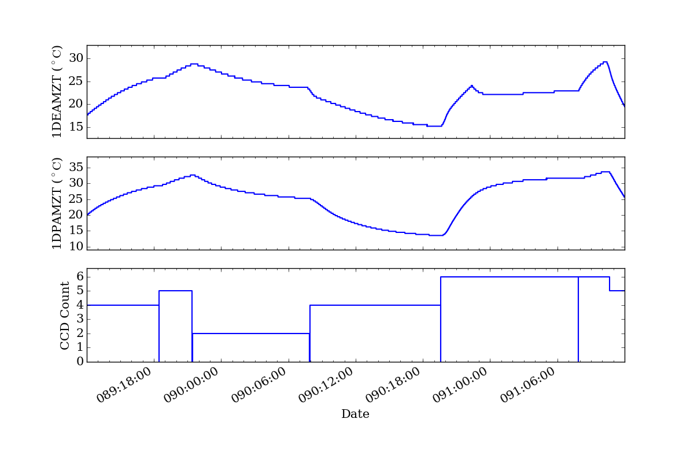

Example 2
+++++++++

.. code-block:: bash

    [~]$ multiplot_archive 2016:091 2016:097 1pdeaat,1pdeabt,1pin1at --one-panel

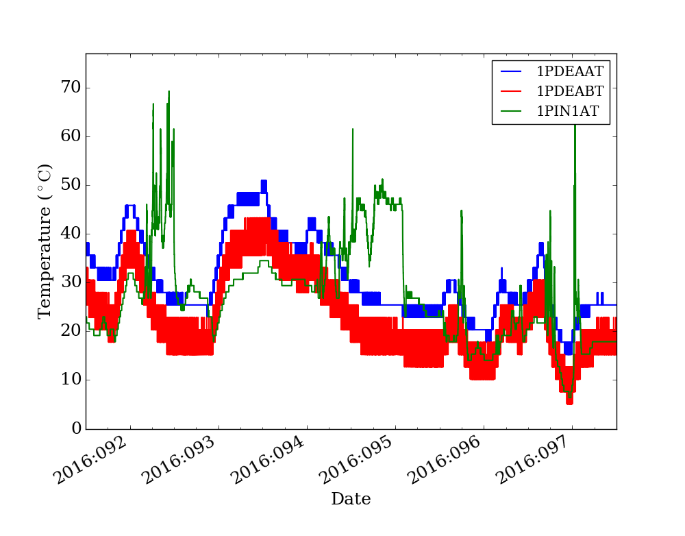

``multiplot_tracelog``
----------------------

.. code-block:: text

    usage: multiplot_tracelog [-h] [--one-panel] tracelog plots
    
    Make plots of MSIDs from a tracelog file. Commanded states will be loaded from
    the commanded states database.
    
    positional arguments:
      tracelog    The tracelog file to load the MSIDs from
      plots       The MSIDs and states to plot, comma-separated
    
    optional arguments:
      -h, --help  show this help message and exit
      --one-panel  Whether to make a multi-panel plot or a single-panel plot. The
                   latter is only valid if the quantities have the same units.

Example 1
+++++++++

.. code-block:: bash
    
    [~]$ multiplot_tracelog acisENG10d_00985114479.70.tl 1pin1at,1dp28avo,simpos
    
Returns:

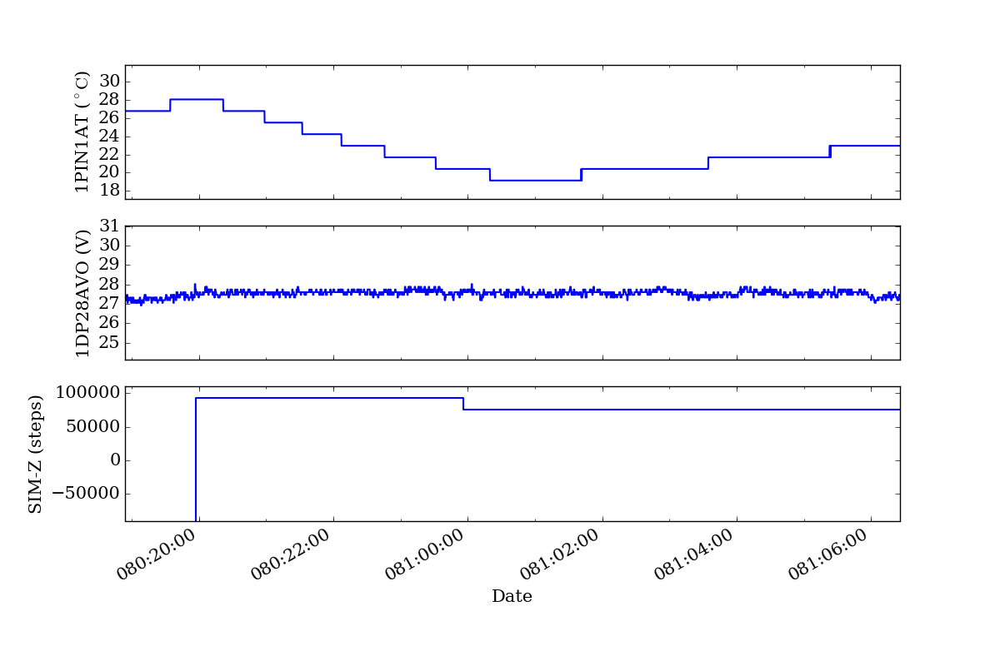

Example 2
+++++++++

.. code-block:: bash
    
    [~]$ multiplot_tracelog acisENG10d_00985114479.70.tl 1dp28avo,1dp28bvo --one-panel
    
Returns:

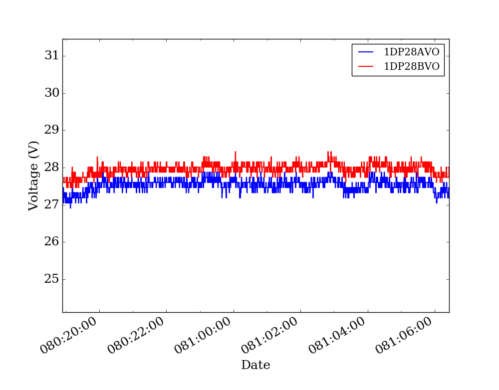

``plot_10day_tl``
-----------------

.. code-block:: text

    usage: plot_10day_tl [-h] [--days DAYS] [--one-panel] fields

    Plot one or more MSIDs or states from the ACIS 10-day tracelog files.

    positional arguments:
      fields       The MSIDs and states to plot, comma-separated

    optional arguments:
      -h, --help   show this help message and exit
      --days DAYS  The number of days before the end of the log to plot. Default:
                   10
      --one-panel  Whether to make a multi-panel plot or a single-panel plot. The
                   latter is only valid if the quantities have the same units.

Example 1
+++++++++

Plot one MSID and two states in three different panels.

.. code-block:: bash

    [~]$ plot_10day_tl 1pdeaat,pitch,off_nominal_roll

Returns:

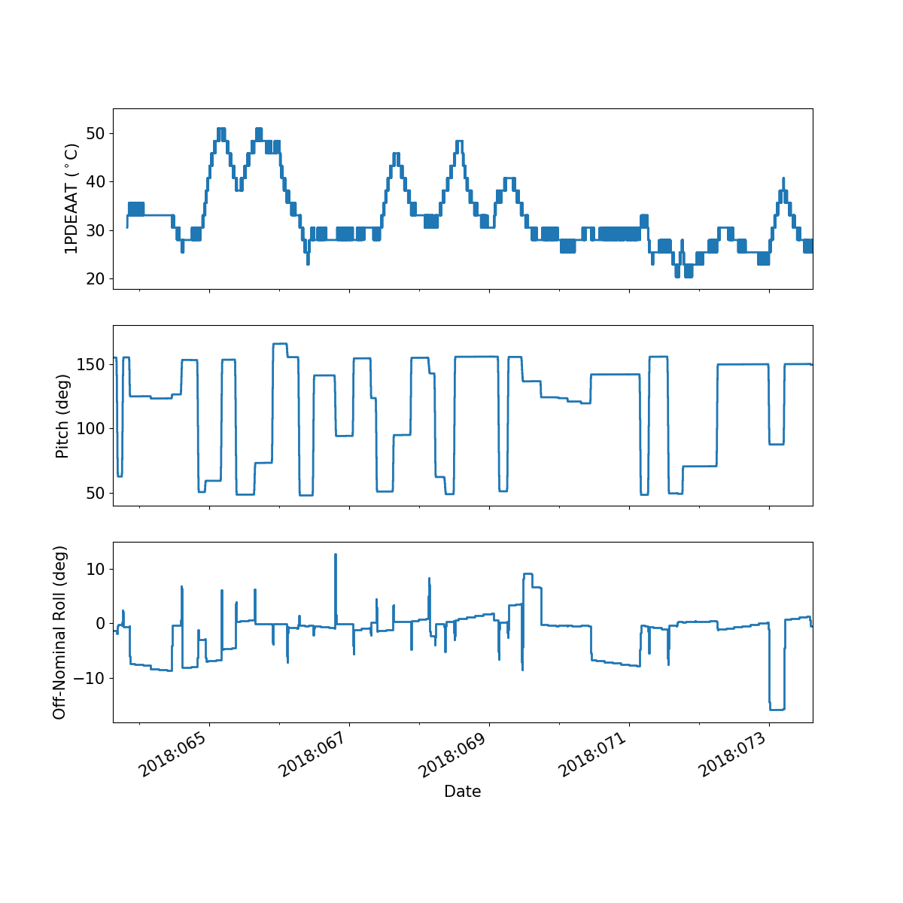

Example 2
+++++++++

Plot 3 MSIDs from ove the past three days and combine them in one panel.

.. code-block:: bash

    [~]$ plot_10day_tl 1dpamzt,tmp_fep1_mong,tmp_bep_pcb --days 3 --one-panel

Returns:

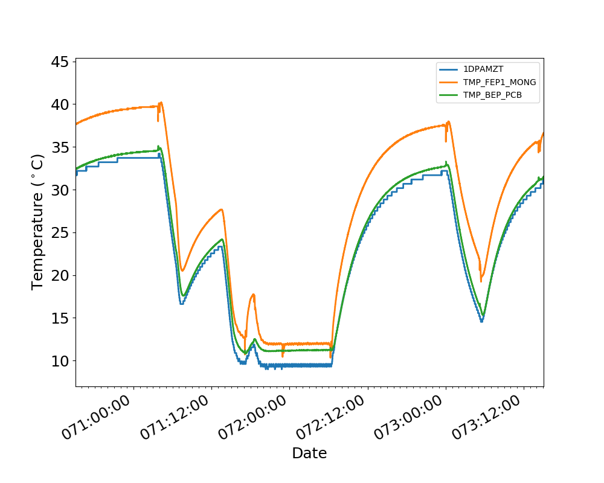

``plot_model``
--------------

.. code-block:: text

    usage: plot_model [-h] [--y2_axis Y2_AXIS] load y_axis
    
    Plot a single model component with another component or state
    
    positional arguments:
      load               The load to take the model from
      y_axis             The model component to plot on the left y-axis
    
    optional arguments:
      -h, --help         show this help message and exit
      --y2_axis Y2_AXIS  The model component or state to plot on the right y-axis
                         (default: none)

Example
+++++++

.. code-block:: bash

    [~]$ plot_model MAR0716A 1dpamzt --y2_axis=off_nominal_roll
    
Returns:

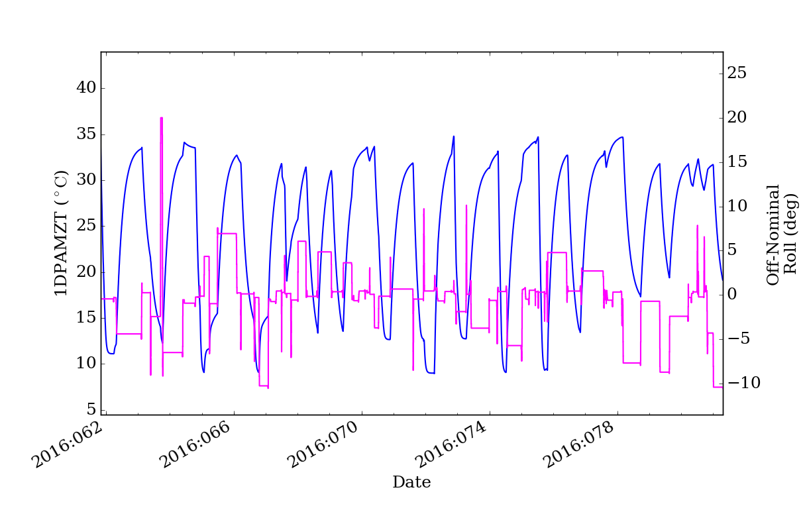

``plot_msid``
-------------

.. code-block:: text

    usage: plot_msid [-h] [--y2_axis Y2_AXIS] [--maude] tstart tstop y_axis
    
    Plot a single MSID with another MSID or state
    
    positional arguments:
      tstart             The start time in YYYY:DOY:HH:MM:SS format
      tstop              The stop time in YYYY:DOY:HH:MM:SS format
      y_axis             The MSID to be plotted on the left y-axis
    
    optional arguments:
      -h, --help         show this help message and exit
      --y2_axis Y2_AXIS  The MSID or state to be plotted on the right y-axis
                         (default: none)
      --maude            Use MAUDE to get telemetry data.

Example
+++++++

Plot 1PIN1AT and pitch. 

.. code-block:: bash

    [~]$ plot_msid 2016:091 2016:095 1pin1at --y2_axis=pitch

Returns:

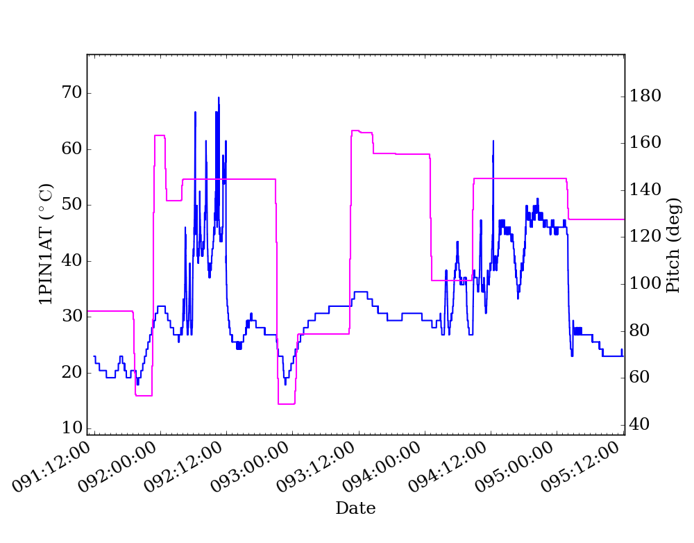

``simulate_ecs_run``
--------------------

.. code-block:: text

    usage: simulate_ecs_run [-h] [--vehicle_load VEHICLE_LOAD] [--simpos SIMPOS]
                            [--off_nominal_roll OFF_NOMINAL_ROLL]
                            [--dh_heater DH_HEATER]
                            component tstart tstop T_init pitch ccd_count

    Simulate an ECS run.

    positional arguments:
      component             The component to model: dpa, dea, or psmc.
      tstart                The start time of the ECS run in YYYY:DOY:HH:MM:SS format
      tstop                 The start time of the ECS run in YYYY:DOY:HH:MM:SS format
      T_init                The initial temperature of the component in degrees C.
      pitch                 The pitch in degrees.
      ccd_count             The number of CCDs to clock.

    optional arguments:
      -h, --help            show this help message and exit
      --vehicle_load VEHICLE_LOAD
                            The vehicle load which is running. Default: None,
                            meaning no vehicle load. If this parameter is set, the
                            input values of pitch and off-nominal roll will be
                            ignored and the values from the vehicle load will be
                            used.
      --simpos SIMPOS       The SIM position. Default: -99616.0
      --off_nominal_roll OFF_NOMINAL_ROLL
                            The off-nominal roll. Default: 0.0
      --dh_heater DH_HEATER
                            Is the DH heater on (1) or off (0)? Default: 0/off.

Example 1
+++++++++

To run the 1DPAMZT model with the following conditions:

* Start time: 2015:100:12:45:30
* Stop time: 2015:101:12:45:30
* Initial temperature: 10.0 degrees C
* Pitch: 150 degrees
* CCD count: 6
* Off-nominal roll: 12.0 degrees

.. code-block:: bash

    [~]$ simulate_ecs_run dpa 2015:100:12:45:30 2015:101:12:45:30 10.0 150. 6 --off_nominal_roll 12.0

Returns:

.. code-block:: text

    acispy: [INFO     ] 2017-09-14 14:23:36,930 Run Parameters
    acispy: [INFO     ] 2017-09-14 14:23:36,930 --------------
    acispy: [INFO     ] 2017-09-14 14:23:36,930 Start Datestring: 2015:100:12:45:30
    acispy: [INFO     ] 2017-09-14 14:23:36,930 Stop Datestring: 2015:101:12:45:30.000
    acispy: [INFO     ] 2017-09-14 14:23:36,931 Initial Temperature: 10 degrees C
    acispy: [INFO     ] 2017-09-14 14:23:36,931 CCD Count: 6
    acispy: [INFO     ] 2017-09-14 14:23:36,931 Pitch: 150.0
    acispy: [INFO     ] 2017-09-14 14:23:36,931 SIM Position: -99616
    acispy: [INFO     ] 2017-09-14 14:23:36,931 Off-nominal Roll: 12.0
    acispy: [INFO     ] 2017-09-14 14:23:36,931 Detector Housing Heater: OFF
    acispy: [INFO     ] 2017-09-14 14:23:36,931 Model Result
    acispy: [INFO     ] 2017-09-14 14:23:36,931 ------------
    acispy: [INFO     ] 2017-09-14 14:23:36,932 The limit of 35.5 degrees C will be reached at 2015:100:21:12:32.816, after 30.4228 ksec.
    acispy: [INFO     ] 2017-09-14 14:23:36,932 The limit is reached before the end of the observation.
    acispy: [WARNING  ] 2017-09-14 14:23:36,932 This observation is NOT safe from a thermal perspective.
    acispy: [INFO     ] 2017-09-14 14:23:37,499 Image of the model run has been written to ecs_run_dpa_6chip_2015:100:12:45:30.png.

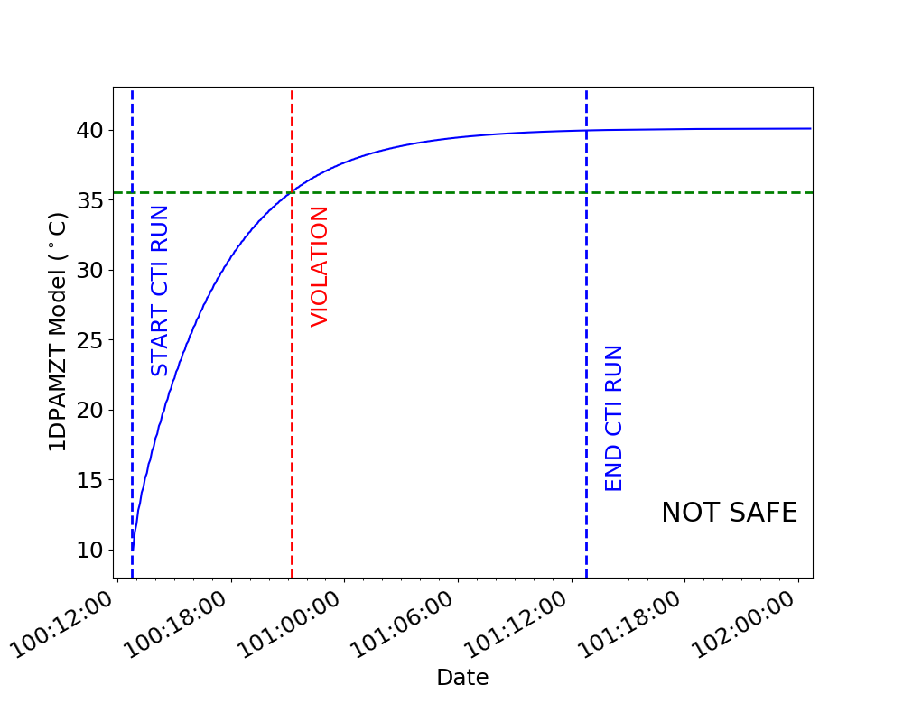

Example 2
+++++++++

To run the 1DEAMZT model with the following conditions:

* Start time: 2017:069:15:40:00
* Stop time: 2017:070:10:00:00
* Initial temperature: 7.5 degrees C
* Pitch: 150 degrees
* CCD count: 4
* Off-nominal roll: 0.0 degrees

.. code-block:: bash

    [~]$ simulate_ecs_run dea 2017:069:15:40:00 2017:070:10:00:00 7.5 150. 4 --off_nominal_roll 0.0

Returns:

.. code-block:: text

    acispy: [INFO     ] 2017-09-14 14:26:16,008 Run Parameters
    acispy: [INFO     ] 2017-09-14 14:26:16,008 --------------
    acispy: [INFO     ] 2017-09-14 14:26:16,008 Start Datestring: 2017:069:15:40:00
    acispy: [INFO     ] 2017-09-14 14:26:16,008 Stop Datestring: 2017:070:10:00:00.000
    acispy: [INFO     ] 2017-09-14 14:26:16,008 Initial Temperature: 7.5 degrees C
    acispy: [INFO     ] 2017-09-14 14:26:16,008 CCD Count: 4
    acispy: [INFO     ] 2017-09-14 14:26:16,008 Pitch: 150.0
    acispy: [INFO     ] 2017-09-14 14:26:16,009 SIM Position: -99616
    acispy: [INFO     ] 2017-09-14 14:26:16,009 Off-nominal Roll: 0.0
    acispy: [INFO     ] 2017-09-14 14:26:16,009 Detector Housing Heater: OFF
    acispy: [INFO     ] 2017-09-14 14:26:16,009 Model Result
    acispy: [INFO     ] 2017-09-14 14:26:16,009 ------------
    acispy: [INFO     ] 2017-09-14 14:26:16,009 The limit of 35.5 degrees C is never reached.
    acispy: [INFO     ] 2017-09-14 14:26:16,009 This observation is safe from a thermal perspective.
    acispy: [INFO     ] 2017-09-14 14:26:16,546 Image of the model run has been written to ecs_run_dea_4chip_2017:069:15:40:00.png.

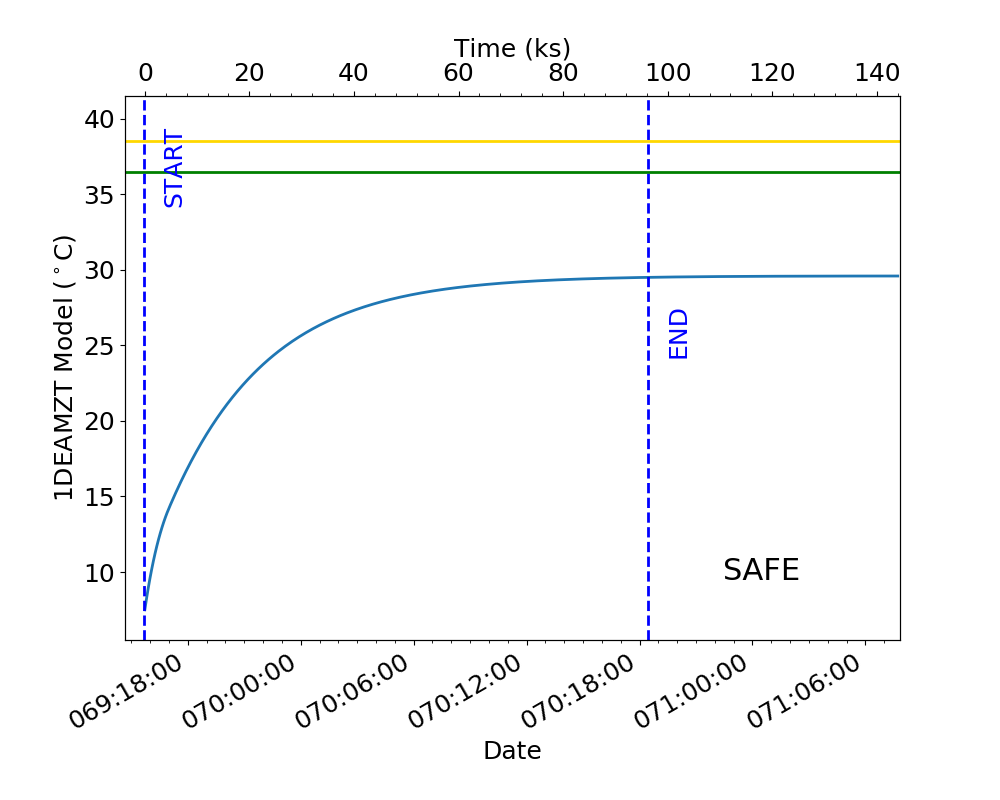

Example 3
+++++++++

This example assumes that the vehicle loads are still running, which means
that the input values of the pitch and the off-nominal roll are ignored in 
favor of 

To run the 1DPAMZT model with the following conditions:

* Start time: 2017:256:03:20:00 
* Stop time: 2017:257:15:20:00
* Initial temperature: 10.0 degrees C
* Pitch: 0 degrees (the value doesn't matter)
* CCD count: 6
* Vehicle load: SEP0917C

.. code-block:: bash

    [~]$ simulate_ecs_run dpa 2017:256:03:20:00 2017:257:15:20:00 10.0 0.0 6 --vehicle_load SEP0917C

Returns:

.. code-block:: text

    acispy: [INFO     ] 2017-09-14 15:40:30,008 Modeling a 6-chip CTI run concurrent with the SEP0917C vehicle loads.
    acispy: [INFO     ] 2017-09-14 15:40:30,684 Run Parameters
    acispy: [INFO     ] 2017-09-14 15:40:30,685 --------------
    acispy: [INFO     ] 2017-09-14 15:40:30,685 Start Datestring: 2017:256:03:20:00
    acispy: [INFO     ] 2017-09-14 15:40:30,685 Stop Datestring: 2017:257:15:20:00.000
    acispy: [INFO     ] 2017-09-14 15:40:30,685 Initial Temperature: 10 degrees C
    acispy: [INFO     ] 2017-09-14 15:40:30,685 CCD Count: 6
    acispy: [INFO     ] 2017-09-14 15:40:30,685 Pitch: Min: 46.56, Max: 156
    acispy: [INFO     ] 2017-09-14 15:40:30,686 SIM Position: -99616
    acispy: [INFO     ] 2017-09-14 15:40:30,686 Off-nominal Roll: Min: -12.5116, Max: 13.7689
    acispy: [INFO     ] 2017-09-14 15:40:30,686 Detector Housing Heater: OFF
    acispy: [INFO     ] 2017-09-14 15:40:30,686 Model Result
    acispy: [INFO     ] 2017-09-14 15:40:30,686 ------------
    acispy: [INFO     ] 2017-09-14 15:40:30,686 The limit of 35.5 degrees C will be reached at 2017:256:09:17:34.816, after 21.4548 ksec.
    acispy: [INFO     ] 2017-09-14 15:40:30,686 The limit is reached before the end of the observation.
    acispy: [WARNING  ] 2017-09-14 15:40:30,686 This observation is NOT safe from a thermal perspective.
    acispy: [INFO     ] 2017-09-14 15:40:31,526 Image of the model run has been written to ecs_run_dpa_6chip_2017:256:03:20:00.png.

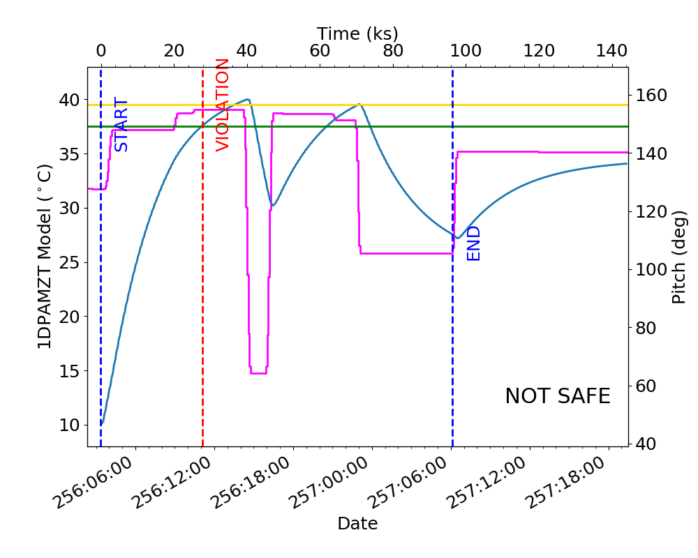

``phase_scatter_plot``
----------------------

.. code-block:: text

    usage: phase_scatter_plot [-h] [--c_field C_FIELD] [--cmap CMAP] [--maude]
                              tstart tstop x_field y_field
    
    Make a phase scatter plot of one MSID or state versus another within a certain
    time frame.
    
    positional arguments:
      tstart             The start time in YYYY:DOY:HH:MM:SS format
      tstop              The stop time in YYYY:DOY:HH:MM:SS format
      x_field            The MSID or state to plot on the x-axis
      y_field            The MSID or state to plot on the y-axis
    
    optional arguments:
      -h, --help         show this help message and exit
      --c_field C_FIELD  The MSID or state to plot using colors
      --cmap CMAP        The colormap to use if plotting colors
      --maude            Use MAUDE to get telemetry data.

Example 1
+++++++++

.. code-block:: bash

    [~]$ phase_scatter_plot 2017:100 2017:200 1deamzt 1dpamzt

Returns:

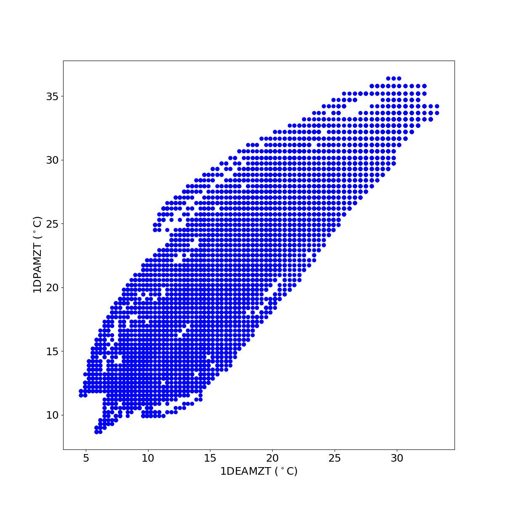

Example 2
+++++++++

.. code-block:: bash

    [~]$ phase_scatter_plot 2017:100 2017:200 1deamzt 1dpamzt --c_field ccd_count --cmap=jet

Returns:

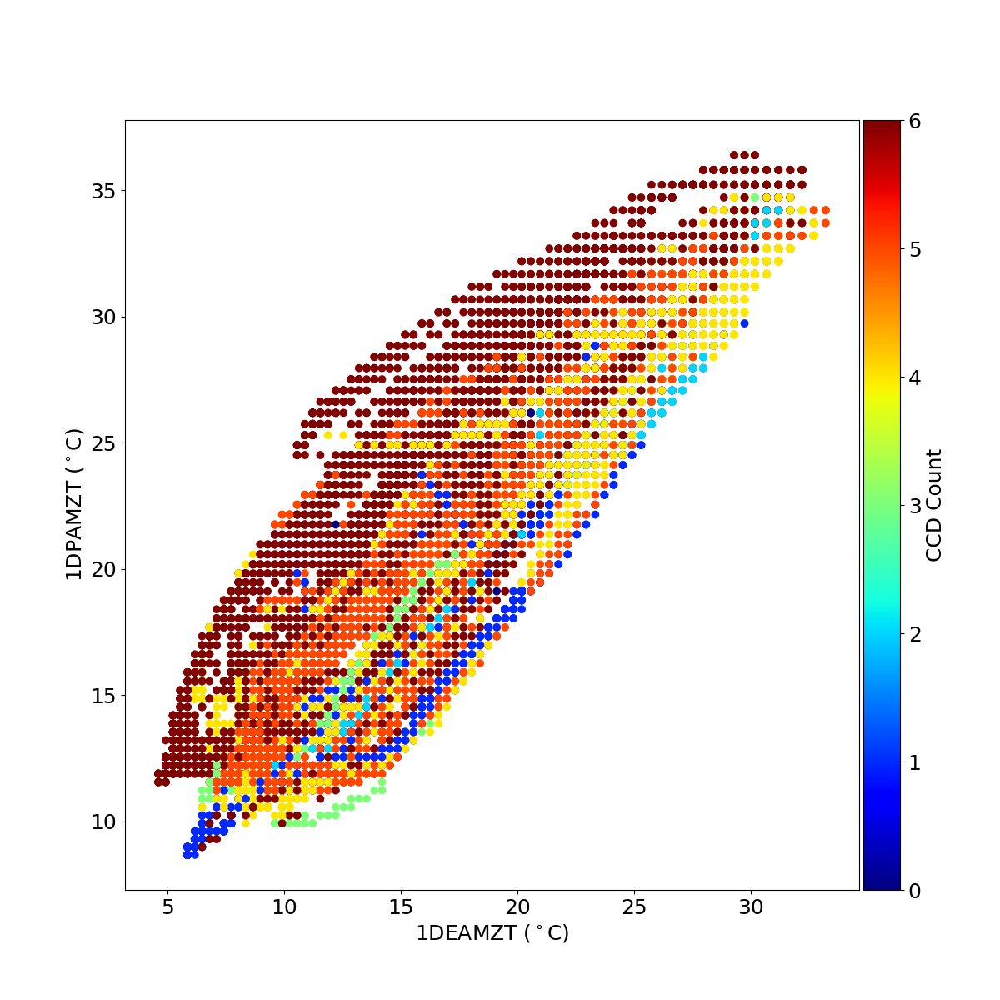

``phase_histogram_plot``
------------------------

.. code-block:: text

    usage: phase_histogram_plot [-h] [--scale SCALE] [--cmap CMAP] [--maude]
                                tstart tstop x_field y_field x_bins y_bins
    
    Make a phase plot of one MSID or state versus another within a certain time
    frame.
    
    positional arguments:
      tstart         The start time in YYYY:DOY:HH:MM:SS format
      tstop          The stop time in YYYY:DOY:HH:MM:SS format
      x_field        The MSID or state to plot on the x-axis
      y_field        The MSID or state to plot on the y-axis
      x_bins         The number of bins on the x-axis
      y_bins         The number of bins on the y-axis
    
    optional arguments:
      -h, --help     show this help message and exit
      --scale SCALE  Use linear or log scaling for the histogram, default 'linear'
      --cmap CMAP    The colormap for the histogram, default 'hot'
      --maude        Use MAUDE to get telemetry data.

Example
+++++++

.. code-block:: bash

    [~]$ phase_histogram_plot 2017:100 2017:200 1deamzt 1dpamzt 40 40 --scale=log --cmap=hsv

Returns:

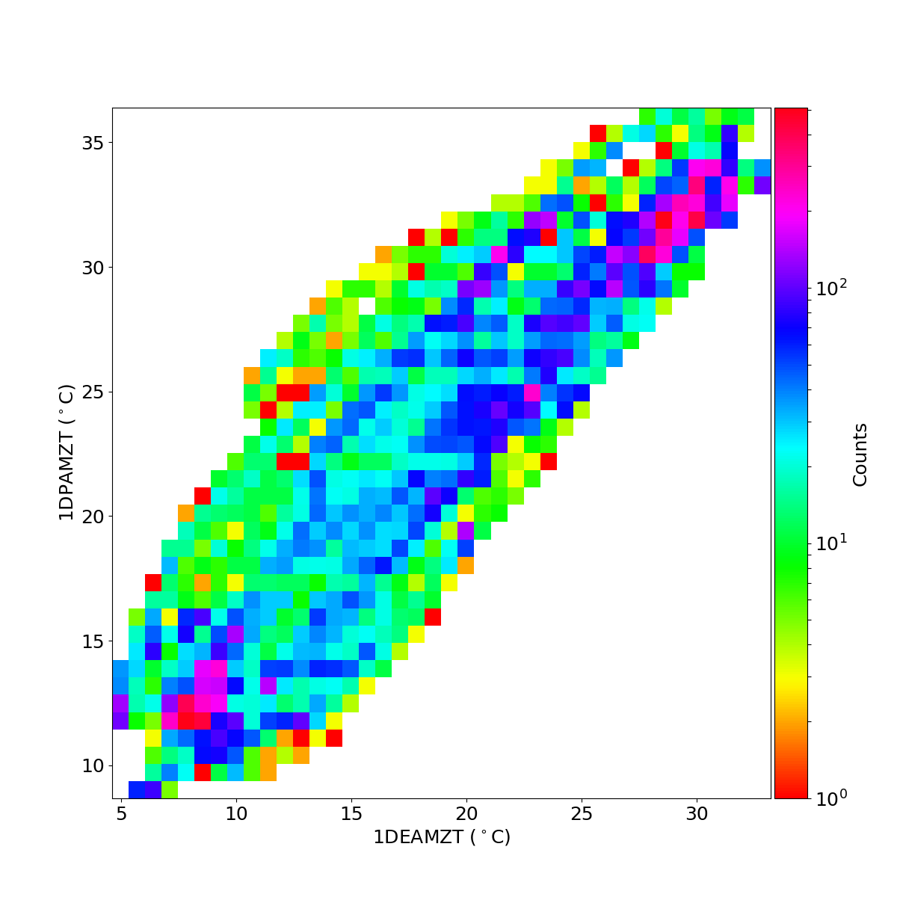