Plotting Data in Python
=======================

ACISpy provides several classes for plotting various quantities. These plots can be 
modified and saved to disk, or used in an interactive session. To make plots appear in an
interactive `IPython <https://ipython.org/>`_ session, do one of the following:

* In an IPython console: start as ``ipython --matplotlib``
* In an IPython Qt console or notebook: start the first cell with ``%matplotlib inline``

For the example plots we'll show, we'll use this :class:`~acispy.data_container.DataContainer`:

.. code-block:: python

    msids = ["1dpamzt", "1deamzt", "1dp28avo"]
    states = ["pitch", "off_nominal_roll", "ccd_count"]
    dc = acispy.DataContainer.fetch_from_database("2015:001", "2015:030", 
                                                  msid_keys=msids,
                                                  state_keys=states)

Creating Plots of Data vs. Time
-------------------------------

The :class:`~acispy.plots.DatePlot` object can be used to make a single-panel plot of one
or more quantities versus the date and time. 

Plot of one MSID vs. time:

.. code-block:: python

    dp1 = acispy.DatePlot(dc, ("msids", "1dpamzt"))

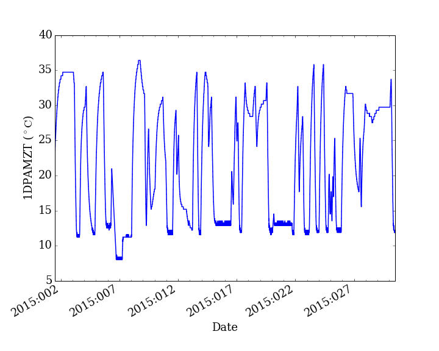

Plot of two MSIDs together vs. time:

.. code-block:: python

    dp2 = acispy.DatePlot(dc, [("msids", "1dpamzt"), ("msids", "1deamzt")])
    
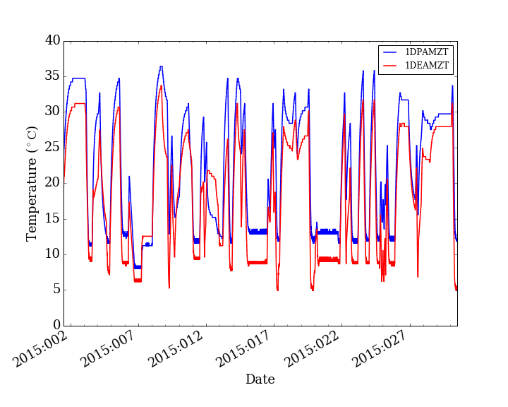

Plot of an MSID on the left y-axis and a state on the right y-axis:

.. code-block:: python

    dp3 = acispy.DatePlot(dc, ("msids", "1dpamzt"), field2=("states", "pitch"))  

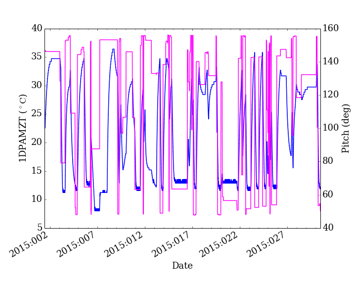

A number of options can be used to modify the :class:`~acispy.plots.DatePlot` when creating
it. For example, the width and color of the lines can be changed:

.. code-block:: python

    dp4 = acispy.DatePlot(dc, ("msids", "1dpamzt"), field2=("states", "pitch"),
                          lw=2, colors="green", color2="purple")  

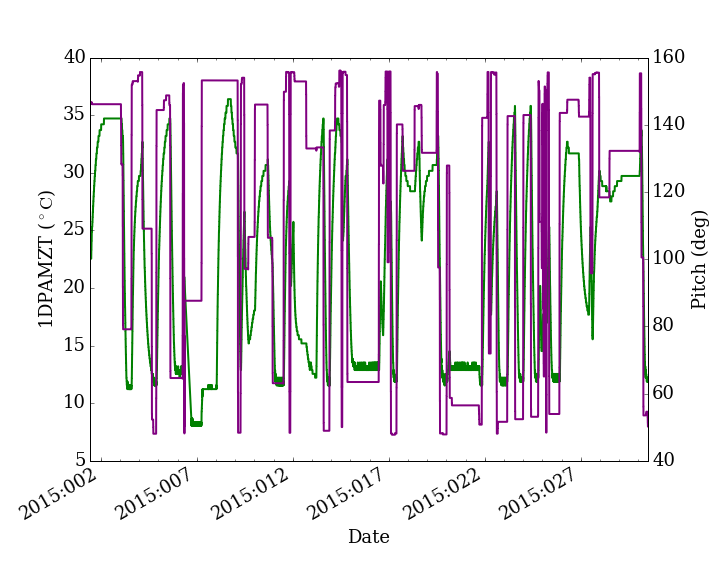

Creating Multi-Panel Plots
--------------------------

The :class:`~acispy.plots.MultiDatePlot` object can be used to make a multiple-panel plot of
multiple quantities versus the date and time. 

By default the panels are stacked vertically:

.. code-block:: python

    mdp1 = acispy.MultiDatePlot(dc, [("states", "pitch"), ("msids", "1deamzt"), ("states","ccd_count")],
                                lw=2, fontsize=17)  

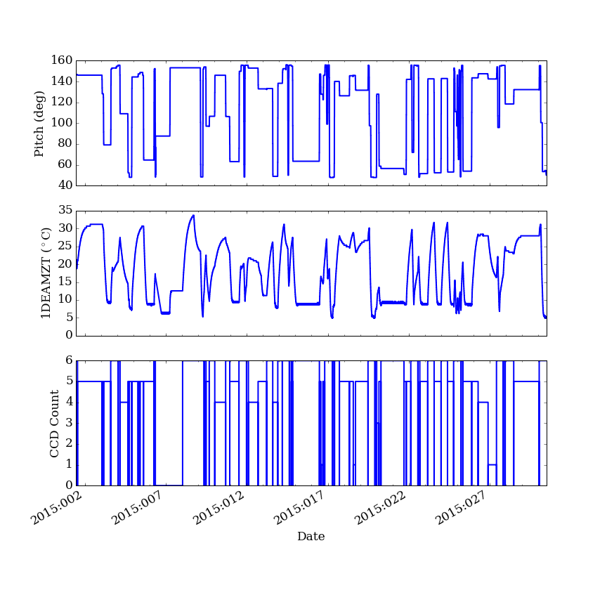

But by using the ``subplots`` keyword argument the panels can be arranged in a ``(n_plot_x, n_plot_y)``
fashion:

.. code-block:: python

    panels = [("states", "pitch"), ("msids", "1deamzt"), 
              ("states", "ccd_count"), ("states", "1dpamzt")]
    mdp2 = acispy.MultiDatePlot(dc, panels, subplots=(2,2))

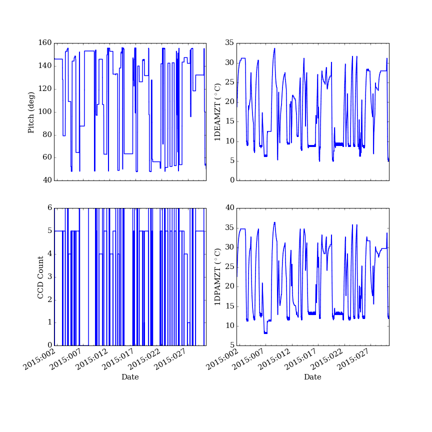

Creating Phase Plots
--------------------

A :class:`~acispy.plots.PhasePlot` shows one quantity plotted versus another. This can be 
helpful when trying to determine the behavior of one MSID versus another, or the dependence 
of an MSID on a particular commanded state. 

A plot of one MSID vs. another:

.. code-block:: python

    pp1 = acispy.PhasePlot(dc, ("msids", "1dpamzt"), ("msids", "1deamzt"))

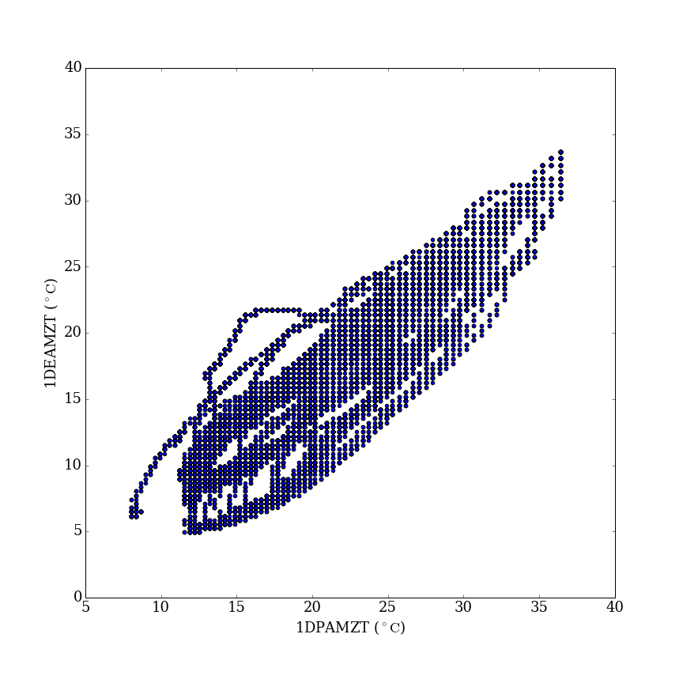

A plot of a MSID vs. a state:

.. code-block:: python

    pp2 = acispy.PhasePlot(dc, ("states", "pitch"), ("msids", "1deamzt"))

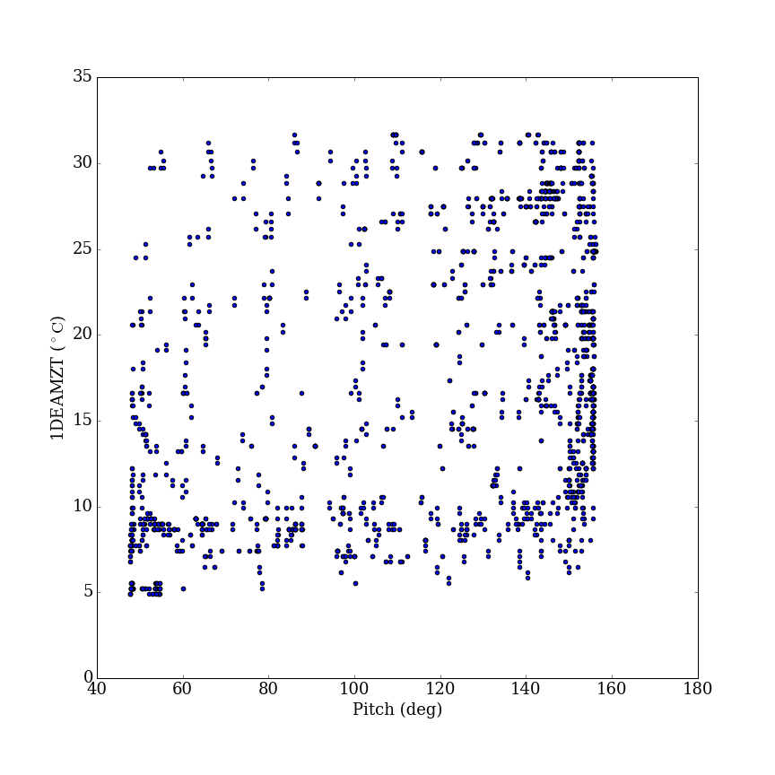

A plot of one state vs. another:

.. code-block:: python

    pp3 = acispy.PhasePlot(dc, ("states", "pitch"), ("states", "off_nominal_roll"))

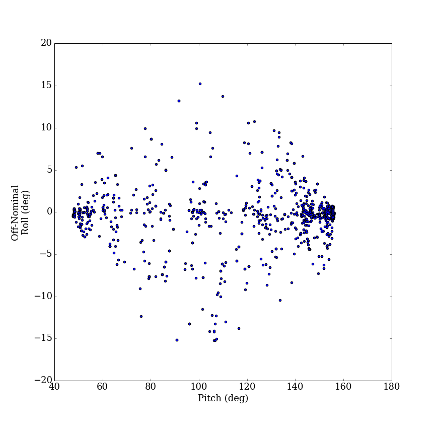

.. note::

    It is not possible to plot an MSID or model component (such as 1DEAMZT) on the
    x-axis vs. state (such as pitch angle) on the y-axis. Place states on the x-axis
    instead.
    
Plot Modifications
------------------

The various plotting classes have methods to control the limits of the plots,
change plot labels, and save plots to disk. 

For :class:`~acispy.plots.DatePlot` and :class:`~acispy.plots.MultiDatePlot`, the 
date/time limits on the x-axis can be set using :meth:`~acispy.plots.DatePlot.set_xlim`. 
For example, the single plot of 1DPAMZT above can be rescaled:

.. code-block:: python

    dp1.set_xlim("2015:012", "2015:022")

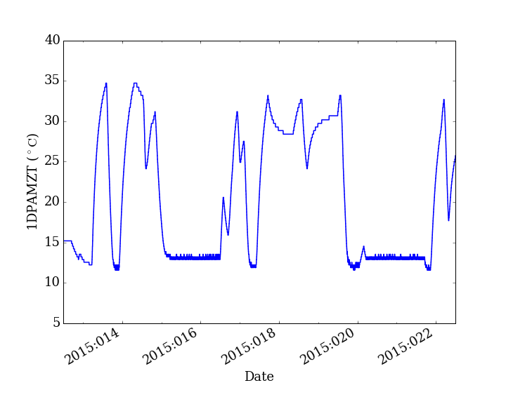

For :class:`~acispy.plots.DatePlot` objects, :class:`~acispy.plots.DatePlot.set_ylim` 
and :class:`~acispy.plots.DatePlot.set_ylim2` can be used to control the limits of the
left and right y-axes of the plot, respectively:

.. code-block:: python

    dp3.set_ylim(10, 35)
    dp3.set_ylim2(60, 140)

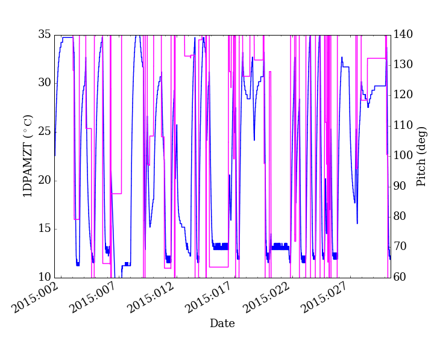

:class:`~acispy.plots.DatePlot.set_ylabel` and :class:`~acispy.plots.DatePlot.set_ylabel2` 
can be used to control the labels of the left and right y-axes of the plot, respectively:

.. code-block:: python

    dp3.set_ylabel("DPA Temperature")
    dp3.set_ylabel2("Pitch Angle")

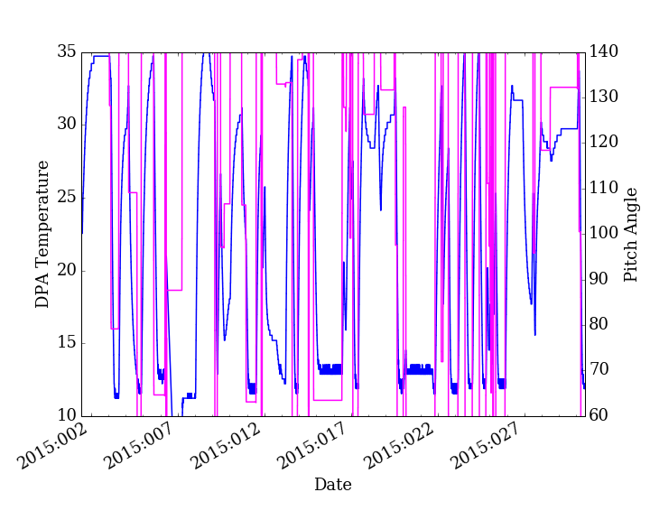

Since the individual panels of each :class:`~acispy.plots.MultiDatePlot` are
:class:`~acispy.plots.DatePlot` instances, these methods work on the individual panels as well:

.. code-block:: python

    mdp1["states", "ccd_count"].set_ylim(0, 7) 

.. images:: _images/multidateplot_ylim.png

:class:`~acispy.plots.PhasePlot` has similar methods for setting the limits and labels:
:class:`~acispy.plots.PhasePlot.set_xlim`, :class:`~acispy.plots.PhasePlot.set_ylim`,
:class:`~acispy.plots.PhasePlot.set_xlabel`, and :class:`~acispy.plots.PhasePlot.set_ylabel`.

Finally, for any of the plotting classes, call ``savefig`` to save the figure. 

.. code-block:: python

    pp1.savefig("phase_plot.png")

